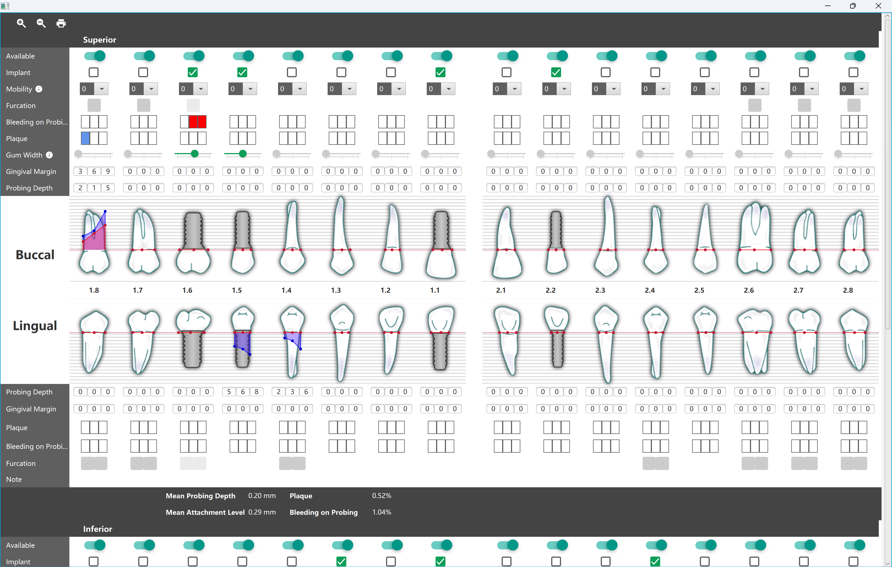

# Dorisoy.PeriodontalChart

该牙周检查图表应用程序是一款专门用于牙科手术和牙周检查的软件工具。它提供了一个直观且功能丰富的界面，使得牙科医生能够轻松地进行牙齿数据的记录、分析和管理。

## 技术栈

**Java** - 主要编程语言和框架.  
**JavaFX** - 用于创建和交付桌面、移动和 Web 应用程序的软件平台.  
**Netbeans** - Java 集成开发环境.  
**Maven** - 发环境

## 界面设计

选项卡设计：界面上方设置了多个选项卡，如“Buccal”（颊侧）、“Lingual”（舌侧）和“Implant”（种植体）等，这些选项卡使得用户能够在不同的检查或治疗阶段之间快速切换。
牙齿模型展示：在选项卡下方，应用程序展示了一系列的牙齿模型。这些模型不仅具有视觉上的吸引力，还通过标注不同的参数值（如长度、宽度等）来提供详细的牙齿信息。
颜色编码：参数值以蓝色和红色表示不同状态或条件，这种颜色编码方式使得用户能够迅速识别牙齿的健康状况或存在的问题。
整体布局：整个界面使用了深浅不一的颜色来区分不同的部分和数据类型，这不仅提高了界面的美观性，还有助于用户更清晰地理解数据。

## 功能特点

数据记录：应用程序允许用户记录每颗牙齿的详细参数值，包括长度、宽度等，以及种植体的相关信息。这些数据可以作为后续分析和治疗的基础。
数据分析：通过内置的算法和工具，应用程序能够对记录的数据进行处理和分析，如计算平均探诊深度等。这些分析结果有助于医生更准确地评估患者的牙周健康状况。
可视化展示：除了提供数字参数外，应用程序还通过牙齿模型和颜色编码等方式将数据可视化展示。这种展示方式使得医生能够更直观地理解数据，并快速识别问题区域。
备注功能：应用程序还提供了备注功能，允许用户在图表旁边添加额外的注释或说明。这有助于医生记录患者的特殊情况或治疗建议。

## 应用场景

牙周检查：该应用程序可以作为牙周检查的主要工具之一，帮助医生记录和分析患者的牙周健康状况。
治疗计划制定：通过分析记录的数据和可视化展示的结果，医生可以制定更精确的治疗计划。
患者教育：医生可以使用该应用程序向患者展示他们的牙周健康状况和治疗计划，从而提高患者的参与度和理解度。

## 屏幕

  
  
  
  

